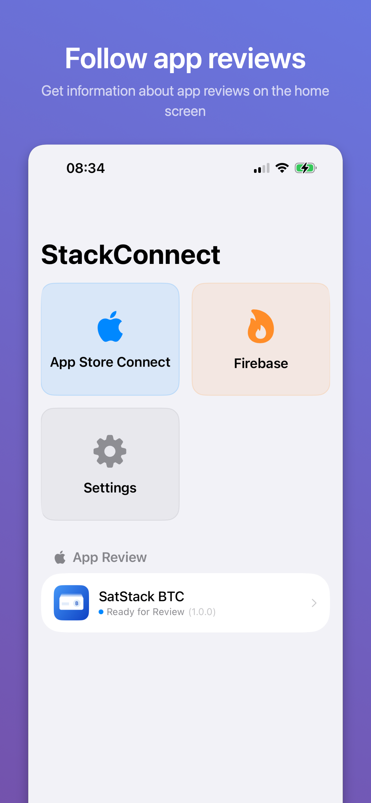
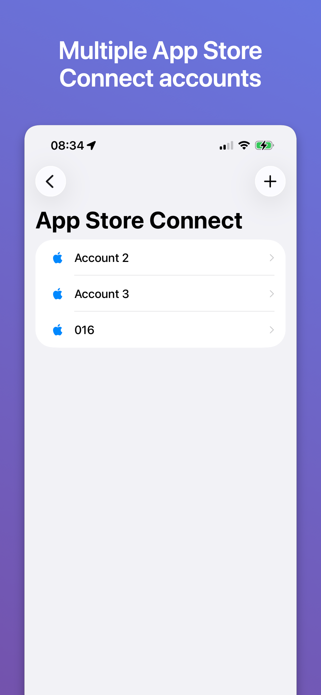
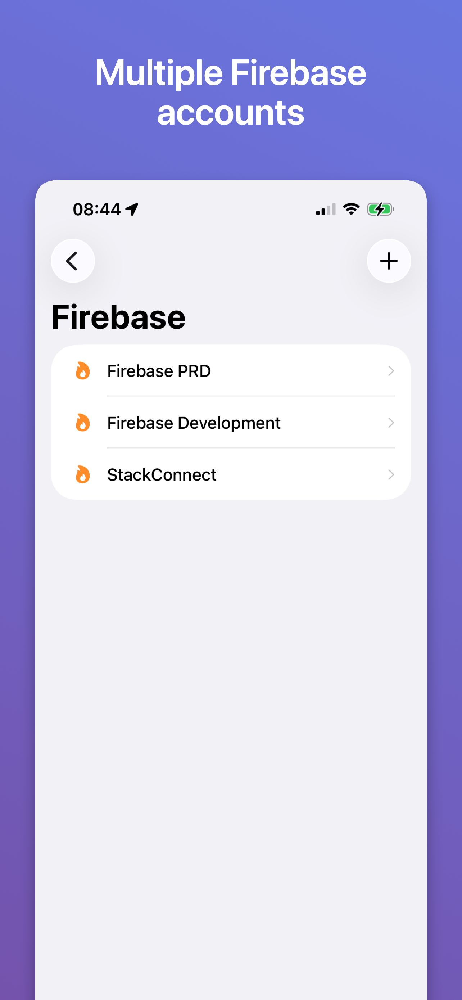
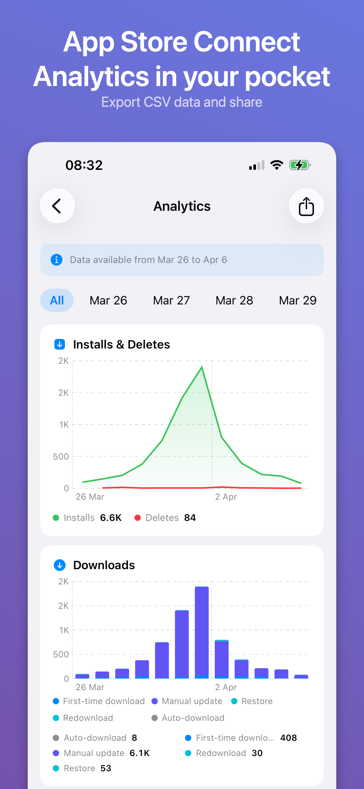
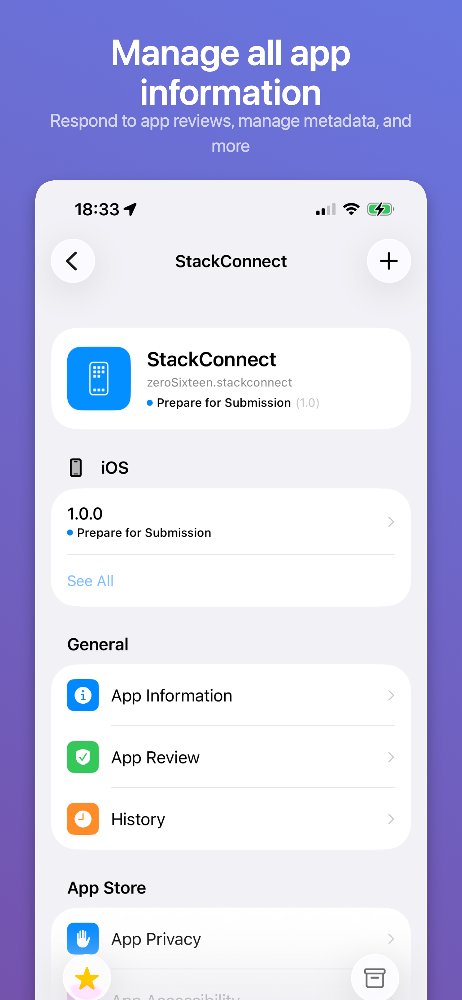
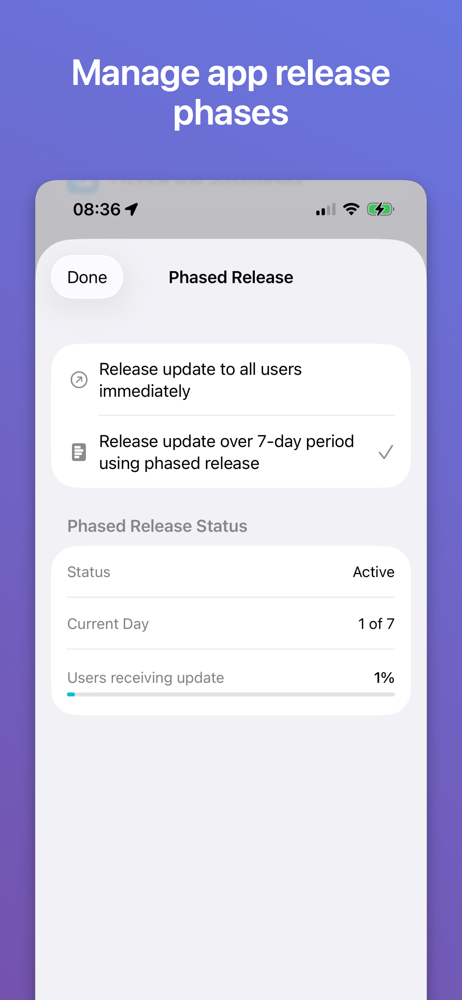
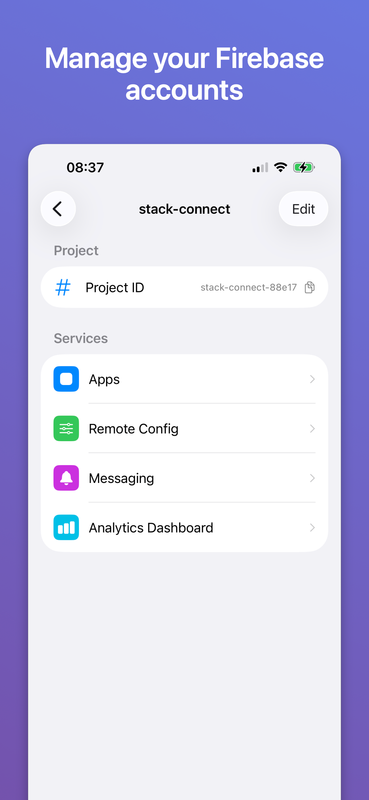
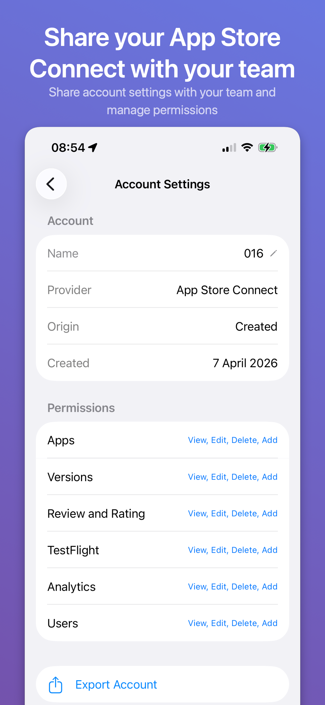

# StackConnect

A native iOS app to manage your **App Store Connect**, **Firebase**, and **Google Play** developer accounts from a single place. From a unified interface you can browse apps, edit version metadata, manage TestFlight groups, reply to customer reviews, view analytics, manage Firebase Remote Config and FCM campaigns, and securely export/import accounts to share with your team.

Built with SwiftUI for iOS 17+.

## Download

<a href="https://apps.apple.com/br/app/stackconnect/id6761390987">
  
</a>

[Download StackConnect on the App Store](https://apps.apple.com/br/app/stackconnect/id6761390987)

## Running the app

### Requirements
- Xcode 16.3+
- iOS 17.0+
- [XcodeGen](https://github.com/yonaskolb/XcodeGen)

### Steps

1. Clone the repository:
   ```bash
   git clone https://github.com/r1b2ns/stack-connect.git
   cd stack-connect
   ```

2. Generate the Xcode project (the `.xcodeproj` is not checked in):
   ```bash
   xcodegen generate --spec project.yml
   ```

3. Open `StackConnect.xcodeproj` in Xcode.

4. Select the **StackConnect Development** scheme and run on a simulator or device.

> Re-run `xcodegen generate --spec project.yml` whenever source files, Swift package dependencies, or build settings change.

## Screenshots

| | | | |
|:-:|:-:|:-:|:-:|
|  |  |  |  |
|  |  |  |  |

## License

This project is licensed under the MIT License. See [LICENSE](LICENSE) for details.
